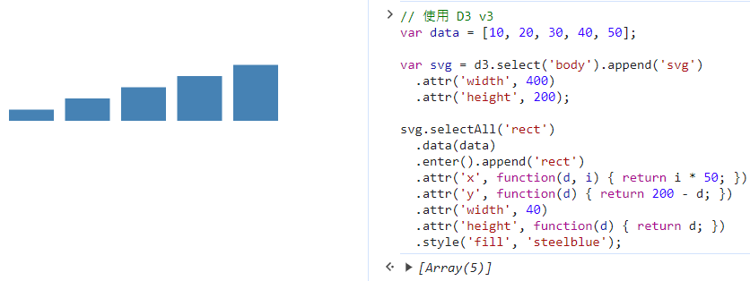
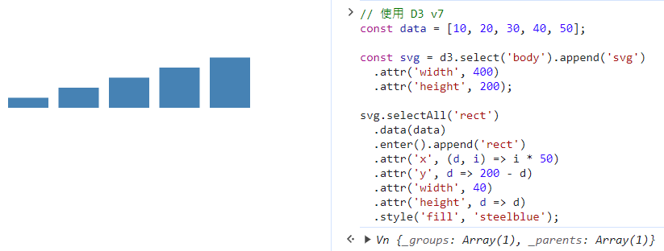

# Math.random()

> 函數 `Math.random()` 會回傳一個偽隨機小數 (pseudo-random) 介於 0 到 1 之間( 0 <= x < 1) 

1. Getting a random number between 0 (inclusive) and 1 (exclusive)
~~~js
function getRandom() {
  return Math.random();
}
~~~

2. Getting a random number between two values
~~~js
function getRandomArbitrary(min, max) {
  return Math.random() * (max - min) + min;
}
~~~

3. Getting a random integer between two values
~~~js
function getRandomInt(min, max) {
  min = Math.ceil(min);
  max = Math.floor(max);
  return Math.floor(Math.random() * (max - min) + min); //The maximum is exclusive and the minimum is inclusive
}
~~~

4. Getting a random integer between two values, inclusive
~~~js
function getRandomIntInclusive(min, max) {
  min = Math.ceil(min);
  max = Math.floor(max);
  return Math.floor(Math.random() * (max - min + 1) + min); //The maximum is inclusive and the minimum is inclusive
}
~~~


### 參考資料
* [Math.random()](https://developer.mozilla.org/zh-TW/docs/Web/JavaScript/Reference/Global_Objects/Math/random#%E5%98%97%E8%A9%A6%E4%B8%80%E4%B8%8B) 
* [Javascript 初學](https://hackmd.io/_6ue_XDBSBmwouAF5iAEJw?view) 

# D3 v3 跟 v7 的差異

1. 模組系統的改變：
- D3 v3 使用 d3.layout 來管理佈局模組，而 D3 v7 使用新的模組系統，不再使用 d3.layout。
- D3 v7 中，模組以獨立的方式引入，例如 import { scaleLinear } from 'd3-scale';。
2. 選擇器 API 改進：
- D3 v7 中，選擇器的 API 較為簡潔和一致，更容易理解和使用。
- D3 v3 中，選擇器 API 較為冗長，例如 d3.select('#elementId')。
3. 選擇集的改變：
- D3 v7 中，選擇集的行為有所改變，對於空選擇集的處理更加一致，返回空選擇集而非 null 或 undefined。
- D3 v3 中，空選擇集的行為可能會不同。
4. 函數的寫法：
- D3 v7 中，函數的寫法可能會使用 ES6+ 的語法，如箭頭函數。
- D3 v3 中，函數的寫法可能更傳統，不使用 ES6+ 的語法。
> 範例：建一個簡單的長條圖，以比較兩者之間的差異。
```js
// 使用 D3 v3
var data = [10, 20, 30, 40, 50];

var svg = d3.select('body').append('svg')
  .attr('width', 400)
  .attr('height', 200);

svg.selectAll('rect')
  .data(data)
  .enter().append('rect')
  .attr('x', function(d, i) { return i * 50; })
  .attr('y', function(d) { return 200 - d; })
  .attr('width', 40)
  .attr('height', function(d) { return d; })
  .style('fill', 'steelblue');
```

```js
// 使用 D3 v7
const data = [10, 20, 30, 40, 50];

const svg = d3.select('body').append('svg')
  .attr('width', 400)
  .attr('height', 200);

svg.selectAll('rect')
  .data(data)
  .enter().append('rect')
  .attr('x', (d, i) => i * 50)
  .attr('y', d => 200 - d)
  .attr('width', 40)
  .attr('height', d => d)
  .style('fill', 'steelblue');
```
